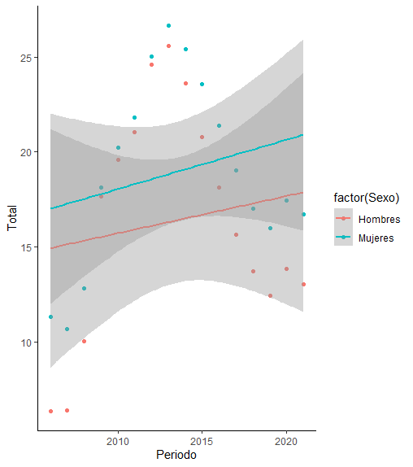
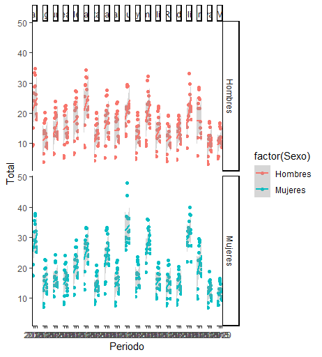
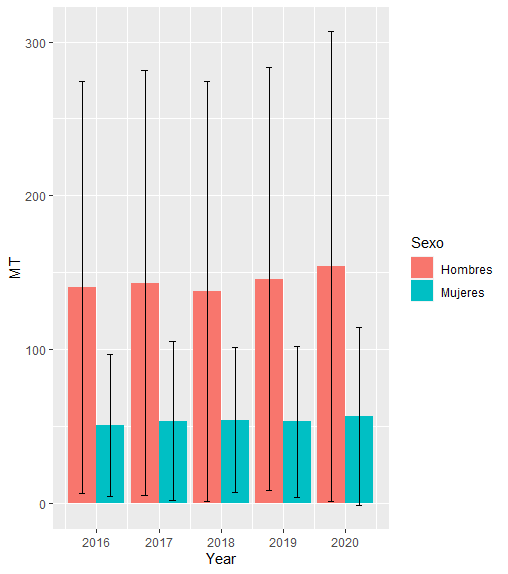
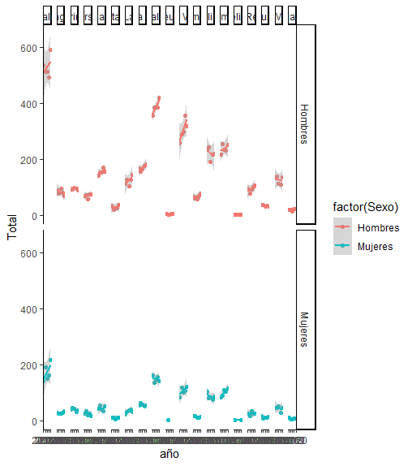

# Índice de contenidos
1. Introducción
2. Métodos
3. Desarrollo
4. Resultados
5. Conclusiones

## Introducción
En este proyecto, en el que analizamos los datos de suicidio y de paro a nivel nacional a lo largo de un gran periodo de años, buscamos responder a una serie de objetivos o preguntas que nos propusimos antes de iniciar dicho proyecto. 
Entre los objetivos en los que nos vamos a centrar durante el desarrollo del seminario tenemos:

1. VARIACIÓN DE PARO RESPECTO AL SEXO POR AÑOS
   VARIACIÓN DE SUICIDIO RESPECTO AL SEXO POR AÑOS
2. VARIACION DE PARO RESPECTO A LOS AÑOS, AL SEXO Y A COMUNIDAD AUTONOMA
   VARIACION DE SUICIDIOS RESPECTO A LOS AÑOS, AL SEXO Y A COMUNIDAD AUTONOMA
3. VER SI EXISTE O NO RELACIÓN ENTRE LA CANTIDAD DE PARO, Y EL NÚMERO DE SUICIDIOS

## Métodos utilizados
Durante el desarrollo y estudio del seminario, hemos utilizado numerosas librerías, entre las que cabe destacar:

1. library(readr)

Utilizamos readr para importar los datos extraídos de la base de datos del gobierno de España (gob.es), y dichos datos están disponibles en la carpeta input/data del repositorio Github.

2. library(dplyr)

Utilizamos dplyr para modificar y filtrar los datos, para así obtener tan sólo aquellos que fueran de gran interés para ayudarnos a contestar las preguntas que propusimos antes de comenzar el proyecto.

3. library(ggplot2)

Utilizamos ggplot2 para representar de forma visual, mediante gráficos de todo tipo, los datos. 

## Desarrollo 
Antes de realizar nada, tuvimos que buscar los datos. Ambos sets de datos los recogimos de la base de datos del gobierno de España (gob.es), y lo insertamos en el proyecto, para poder estudiarlos y modificarlos de cara a los objetivos propuestos.
Para la tasa de paro, importamos los datos de la siguiente manera:
```{r , eval = FALSE}
library(readr)
Tasa_de_Paro <- read_delim("input/data/Tasa_de_Paro.csv", 
                           delim = ";", escape_double = FALSE, 
                           col_types = cols(Total = col_double()), 
                           trim_ws = TRUE)
```
Por otro lado, para los datos de suicidio, tuvimos que importarlo de la siguiente forma:
```{r , eval = FALSE}
library(readr)
Suicidio <- read_delim("input/data/Suicidio.csv", 
                       delim = ";", escape_double = FALSE, 
                       col_types = cols(Total = col_double()), 
                       trim_ws = TRUE)
```

Una vez teníamos los datos importados en el proyecto, procedimos a filtrarlos para que mostraran sólo aquella información que fuera de utilidad para el proyecto. Para poder llegar a los objetivos propuestos, tuvimos que modificar ambos sets de datos.


Para los datos de tasa de paro:

1. Filtramos los datos para que nos salieran sólo aquellos datos que nos muestraran HOMBRES Y MUJERES, AMBOS SEPARADOS, eliminando así aquellos datos que contenían una línea para "ambos sexos". Hicimos esto porque, para los objetivos que nos propusimos, era primordial filtrar por sexos, para, posteriormente estudiar, si hubieran, las diferencias entre ambos.
```{r , eval = FALSE}
library(dplyr)
Tasa_de_Paro <-
  Tasa_de_Paro %>%
  mutate(Sexo = factor(Sexo)) %>%
  filter(Sexo != "Ambos sexos") %>%
  droplevels()

## para ver qué niveles de sexo tiene ahora el set de datos
levels(Tasa_de_Paro$Sexo)
## sólo tendrá Hombres y Mujeres, porque hemos eliminado la categoría "ambos sexos" ya que no es objeto de estudio
## (comprobamos que la categoria "ambos sexos", ha desaparecido)
Tasa_de_Paro %>%
  filter(Sexo != "Ambos sexos") %>%
  levels() ## nos sale NULL porque ha desaparecido

```


## Resultados obtenidos
Para la variación del paro a lo largo de los años, necesitamos un gráfico que muestre cómo varía el paro nacional respecto al sexo y respecto al paso del tiempo.
Para ello propusimos lo siguiente:
```{r , eval = FALSE}
  ggplot(data = Paro_Total_Año, aes(x = Periodo, y = Total)) +
  geom_point(aes(colour = factor(Sexo))) +
  theme_light() +
  geom_smooth(method = "lm", aes(colour = factor(Sexo))) +
  theme_classic()

```



Por otro lado, para la variación del paro respecto a las Comunidades Autónomas de las que consta España, necesitamos un gráfico en que que noos muestre el paro respecto a hombres y mujeres, respecto al tiempo en todas y cada una de las comunidades autónomas
Para ello hicimos lo siguiente:
```{r , eval = FALSE}
  ggplot(data = Tasa_de_Paro_CCAA, aes(x = Periodo, y = Total)) +
  geom_point(aes(colour = factor(Sexo))) +
  facet_grid(Sexo ~ Tasa_de_Paro_CCAA$`Comunidades y Ciudades Autónomas`) +
  geom_smooth(method = "lm", aes(colour = factor(Sexo))) +
  theme_light() + 
  theme_classic()

```

Posteriormente, para la variación del suicidio respecto al sexo y al paso del tiempo, necesitabamos una grafica en la que nos mostrara todos los casos de suicidios, tanto de hombres como de mujeres, por cada uno de los años.
Para ello:
```{r , eval = FALSE}
ggplot(data = Suicidio_Total, aes(x = Year, y = MT, fill = Sexo))+
  geom_bar( stat = "identity", position = "dodge")+
  geom_errorbar(aes(ymin = MT- desviacion, ymax = MT + desviacion), width=.2,
  position=position_dodge(.9) ) 
```


Por último, para la variación del suicidio respecto al sexo y al paso del tiempo por cada Comunidad Autónoma de España, necesitabamos una grafica en la que nos mostrara todos los casos de suicidios, tanto de hombres como de mujeres, por cada uno de los años en cada una de las comunidades.
Para ello:
```{r , eval = FALSE}
ggplot(data = Suicidio, aes(x = año, y = Total)) +
  geom_point(aes(colour = factor(Sexo))) +
  facet_grid(Sexo ~ Suicidio$`Comunidades y Ciudades Autónomas`) +
  geom_smooth(method = "lm", aes(colour = factor(Sexo))) +
  theme_light() + 
  theme_classic()
```


## Conclusiones y discusión de los resultados

En la primera de las gráficas, en la que representamos tasa de paro respecto al sexo, podemos obsevar como la tasa de paro en mujeres es mayor respecto a la tasa de hombres, durante todos loa años estudiados, es decir, desde 2006 a 2021. Sin embargo, podemos observar como al principio de los años esta diferencia de tasas entre ambos sexos era bastante más considerable. A partir de la crisis de 2009 podemos ovserbar como ambas tasas comienzan a acercarse, hasta 2016 donde empiezan a separarse de nuevo, hoy en día, la diferencia sigue siendo notable. 
Esto podemos observarlo más rápidamente con la regresión lineal, en la cual vemos como la de las mujeres está siempre por encima de la de los hombres.


En la segunda de las gráficas, donde represnetamos paro respecto a cada Comunidad Autónoma, podemos observar como hay diferencias considerables entre las diferentes comunidades autónomas, pero, las tasas de paro de ambos sexos parecen estar correlacionadas, ya que se asemejan entre comunidades autónomas, a pesar que en mujeres son algo más elevadas que en hombres; por ejemplo, si nos fijamos en la comunidad autónoma de Andalucía, podemos ver que ambas tasas de paro son las mayores con respecto a las demás; así como en la comunidad de Aragón, ambas tasas descienden con respecto a la de Andalucía. Sin embargo, no es siempre así, porque si nos fijamos en la Comunidad valenciana y País Vasco, se puede observar como la tasa de paro de mujeres es mayor en la Comunidad Valenciana, sin embargo, la tasa de paro en hombres es maor en el País Vasco, por lo que confirmamos que no hay una correlacón exacta, pero sí que van más o menos al apar.


En la tercera de las gráficas, en la que represnetamos el suicidio respecto al sexo, podemos observar claramente como el número de suicidios en todos los años estudiados (2016-2020) es mayor en el sexo masculino que en el sexo femenino. Además, hemos representado la desviación estándar con una línea sobre las barras, de lo que sacamos la concusión que hay gran variedad en el número de suicidios.  (no eme convence mucho)


En la cuarta gráfica, en la que representamos el suicidio respecto a Comunidad Autónoma, podemos observar como hay diferencias considerables entre las diferentes comunidades autónomas, pero, el número de suicidios ambos sexos parecen estar correlacionadas, ya que se asemejan entre comunidades autónomas, a pesar que en hombres son algo más elevadas que en muejeres; por ejemplo, si nos fijamos en la comunidad autónoma de Andalucía, podemos ver que ambos números de suicidio son las mayores con respecto a las demás; así como en la ciudad de Melilla, ambas tasas descienden con respecto a la de Andalucía. 
En este gráfico hay una cosa que llama la atención, ya que en la ciudad de Ceuta en el número de suicidios de hombres hay un único punto, es decir, solo se ha producido un suicidio a lo largo de todos los años estudiados.

Por lo que a simple vista podemos que no hay correlación, ya que la tasa de paro, en cómputo global, es mayor en mujeres que en hombres, y que el número de suicidio es mayor en hombres que en mujeres, pero para asegurarnos procedemos a juntar ambas tablas.