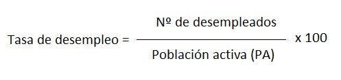
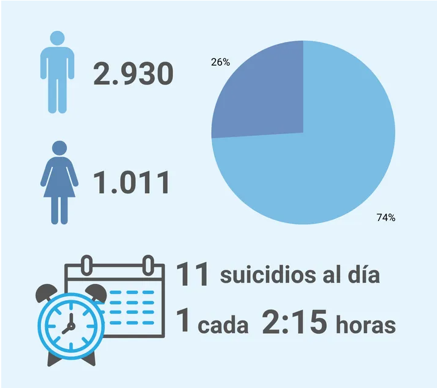
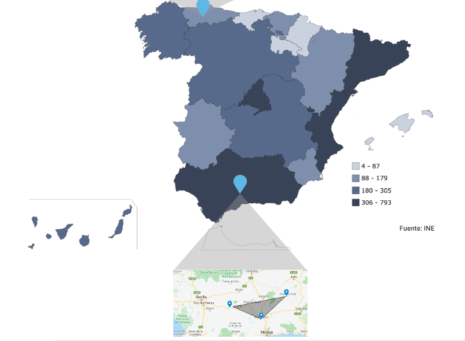

# Índice de contenidos
1. Introducción
2. Objetivos
3. Métodos
4. Desarrollo y Resultados
5. Conclusiones finales

## 1. Introducción
En este proyecto de seminario, trataremos de analizar los datos, respecto al sexo y a cada comunidad autónoma, de la tasa de paro nacional desde el año 2006 hasta el año 2021. A su vez, el seminario tratará de analizar los datos, respecto al sexo y a cada comunidad autónoma, del suicidio en España a lo largo de los años 2016, 2017, 2018, 2019 y 2020.

Posteriormente, tras analizar y estructurar adecuadamente los datos, trataremos de ver la relación, si la hay, entre estos dos aspectos, es decir, trataremos de determinar si hay una relación entre la tasa de paro de una comunidad autónoma, y la cantidad de suicidios que se producen en la misma.

## 2. Objetivos
El desarrollo del seminario se basa en la resolución y/o respuesta de una serie de objetivos bien marcados desde el inicio del proyecto:

1. Variación del paro respecto al sexo por años.
   Variación de suicidios respecto al sexo por años.
   
2. Variación de paro respecto a los años, al sexo y a la comunidad autónoma en España.
   Variación de suicidios respecto a los años, al sexo y a la caomunidad autónoma en España.
   
3. Ver la relación entre el número de suicidios, y la tasa de paro.

## 3. Métodos o paquetes utilizados
Durante el desarrollo y estudio del seminario, hemos utilizado numerosas librerías y paquetes, entre las que cabe destacar:

1. library(readr)

Utilizamos readr para importar los datos extraídos de la base de datos del gobierno de España (<https://datos.gob.es/es/catalogo>). (Dichos datos están disponibles en la carpeta input/data del repositorio Github).

```{r , eval = TRUE,message=FALSE}
library(readr)
```

2. library(dplyr)

Utilizamos dplyr para modificar y filtrar los datos, y obtener así sólo aquellos que fueran de gran interés para ayudarnos a contestar las preguntas que propusimos antes de comenzar el proyecto.

```{r , eval = TRUE,message=FALSE}
library(dplyr)
```

3. library(ggplot2)

Utilizamos ggplot2 para representar de forma visual, mediante gráficos de todo tipo, los datos. 

```{r , eval = TRUE,message=FALSE,warning=FALSE}
library(ggplot2)
```

4. library(tidyverse)

Utilizamos tidyverse para manipular, importar, explorar y visualizar los sets de datos utilizados en el seminario.

```{r , eval = TRUE,message=FALSE,warning=FALSE}
library(tidyverse)
```

5. library(tidyjson)

Utilizamos tidyjson para importar ambos sets de datos en formato json.

```{r , eval = TRUE,message=FALSE,warning=FALSE}
library(tidyjson)
```

6. library(rjson)

Utilizamos rjson para leer los sets de datos que se encuentran en formato json.

```{r , eval = TRUE,message=FALSE,warning=FALSE}
library(rjson)
```


## 4. Desarrollo y resultados

### 4.1. Obtención de los datos
Antes de empezar el seminario, tuvimos que decidir qué datos utilizar y dónde buscarlos. Tras un tiempo, decidimos recoger ambos sets de datos de la base de datos del gobierno de España (<https://datos.gob.es/es/catalogo>).

Concretamente, los datos de tasa de paro los obtuvimos de la siguiente fotografía:


Por otro lado, los datos de suicidio los sacamos de la fotografía que se muestra a continuación:


### 4.2. Importación de los datos

#### 4.2.1. Importación desde Json
Para poder utilizar los datos en Json, tenemos que importarlos y realizar una serie de modificaciones para hacer que dichos datos sean exactamente iguales a los que obtenemos tras importar en CSV.
Para ello, necesitaremos:
- Para la tasa de paro:

Importamos los datos desde JSON
```{r , eval = TRUE,warning=FALSE}
#importamos el set de datos mediante JSON
ParoJSON <- fromJSON(file = "input/data/Paro.json")
```

Distribuimos los predicados del JSON en forma de columnas
```{r , eval = TRUE,warning=FALSE,results='hide'}
#Distribuimos los objetos JSON en forma de nuevas columnas (es decir, colocamos los predicados como columnas)
ParoJSON %>% 
  spread_all() %>%
  str()
```

Estudiamos los tipos de datos que había en cada variable
```{r , eval = TRUE,warning=FALSE}
# Estudiamos el tipo de datos que es cada variable
ParoJSON %>% 
  gather_object %>% 
  json_types %>% 
  count(name, type)
```
Y nos quedamos con aquellas variables en las que el tipo es "array", ya que tendremos que indagar más en ellas y seleccionar los datos que nos interesen.

Por ello, miramos la variable DATA:
```{r , eval = TRUE,warning=FALSE}
# Seleccionamos aquellas columnas que nos interesen de la variable DATA
Paro1_JSON <-
ParoJSON %>%
  enter_object(Data) %>%
  gather_array %>%
  spread_all %>%
  select(Anyo:Valor, document.id)
```

Y la variable METADATA:
```{r , eval = TRUE,warning=FALSE}
# Y hacemos lo mismo con la variable MEGADATA
Paro2_JSON<-
ParoJSON %>%
  enter_object(MetaData) %>%
  gather_array %>%
  spread_all%>%
  select(Nombre, document.id) 
  #filter(Nombre = c("Ambos sexos","Hombres", "Mujeres"))
```

Posteriormente, hacemos el join de ambas variables, para conseguir el set de datos adecuado para trabajar 
```{r , eval = TRUE,warning=FALSE}
JOIN_PARO_JSON <-
Paro1_JSON %>% 
  select(c("Anyo", "Valor", "document.id")) %>%
  full_join(x = ., 
            y = Paro2_JSON %>% 
              select(c("Nombre", "document.id")),
            by = c("document.id") ) 
```

Filtramos el join anterior por años:
```{r , eval = TRUE,warning=FALSE}
#FILTRAMOS POR AÑOS
JOIN_PARO_JSON <-
  JOIN_PARO_JSON %>%
  filter(Anyo>2016)
```
Y nos quedamos en el filtrado por sexo

- Para los datos de suicidio hacemos algo parecido a lo anterior:

Importamos los datos desde JSON
```{r , eval = TRUE,warning=FALSE}
SuicidioJSON <- fromJSON(file = "input/data/suicidios.json")

```

Distribuimos los objetos JSON en forma de nuevas columnas (es decir, colocamos los predicados como columnas)
```{r , eval = TRUE,warning=FALSE, results='hide'}
SuicidioJSON %>%
  spread_all() %>%
  str()
```

Estudiamos el tipo de datos de cada variable
```{r , eval = TRUE,warning=FALSE}
SuicidioJSON %>% 
  gather_object %>% 
  json_types %>% 
  count(name, type)
```

Y estudiamos las variables que tienen el tipo array; DATA y METADATA
Para DATA:

```{r , eval = TRUE,warning=FALSE}
Suicidio1_JSON <-
  SuicidioJSON %>%
    enter_object(Data) %>%
    gather_array %>%
    spread_all %>%
    select("Valor","document.id")
```

Para METADATA:
```{r , eval = TRUE,warning=FALSE}
Suicidio2_JSON <-
  SuicidioJSON %>%
    enter_object(MetaData) %>%
    gather_array %>%
    spread_all%>%
    select("Nombre", "document.id")
```

Luego Hacemos EL JOIN entre las columnas que nos interesan de DATA y MEGADATA para conseguir el set de datos adecuado para trabajar
```{r , eval = TRUE,warning=FALSE}
#LUEGO HACER EL JOIN DE AMBOS

JOIN_SUICIDIO_JSON <-
  Suicidio1_JSON %>% 
  select(c("Valor", "document.id")) %>%
  full_join(x = ., 
            y = Suicidio2_JSON %>% 
              select(c("Nombre", "document.id")),
            by = c("document.id") ) 
```
Y nos quedamos en el filtrado por sexo

#### 4.2.2. Importación desde CSV
Insertamos los datos en el proyecto, para poder estudiarlos y modificarlos de cara a poder resolver los objetivos propuestos.
Para la tasa de paro, importamos los datos de la siguiente manera:
```{r , eval = TRUE,warning=FALSE}
## Para importar los datos de TASA DE PARO:
Tasa_de_Paro <- read_delim("input/data/Tasa_de_Paro.csv", 
                           delim = ";", escape_double = FALSE, 
                           col_types = cols(Total = col_double()), 
                           trim_ws = TRUE)
```

Por otro lado, para los datos de suicidio, tuvimos que importarlo de la siguiente forma:
```{r , eval = TRUE,warning=FALSE}
Suicidio <- read_delim("input/data/Suicidio.csv", 
                       delim = ";", escape_double = FALSE, 
                       col_types = cols(Total = col_double()), 
                       trim_ws = TRUE)
```

### 4.3. Filtrado de datos

Una vez teníamos los datos importados en el proyecto, procedimos a filtrarlos para que mostraran sólo aquella información que fuera de utilidad para el proyecto. Para poder llegar a los objetivos propuestos, tuvimos que modificar ambos sets de datos.


#### 4.3.1. Filtrado para el objetivo de Variación de paro respecto al sexo por años
De cara a conseguir el primero **objetivo de VARIACIÓN DE PARO RESPECTO AL SEXO POR AÑOS**, tuvimos que modificar el set de datos respectivo a la tasa de paro, de la siguiente forma:

##### 4.3.1.1. Cambio en el nombre de las Comunidades Autónomas
Cambiamos el nombre de las comunidades y ciudades autónomas, para poder eliminar los números que aparecían al lado de cada comunidad autónoma, y añadimos los nuevos nombres, a una columna nueva del set de datos, que llamaremos CCAA.
Para ello tuvimos que utilizar case_when:
```{r , eval = TRUE}
Tasa_de_Paro <- Tasa_de_Paro%>%
  mutate(
    CCAA = case_when( ## cambiamos el nombre con un case_When
      Tasa_de_Paro$`Comunidades y Ciudades Autónomas`== "01 Andalucía" ~ "Andalucia",
      Tasa_de_Paro$`Comunidades y Ciudades Autónomas`== "02 Aragón" ~ "Aragon",
      Tasa_de_Paro$`Comunidades y Ciudades Autónomas`== "03 Asturias. Principado de" ~ "Asturias",
      Tasa_de_Paro$`Comunidades y Ciudades Autónomas`== "04 Balears. Illes" ~ "Baleares",
      Tasa_de_Paro$`Comunidades y Ciudades Autónomas`== "05 Canarias" ~ "Canarias",
      Tasa_de_Paro$`Comunidades y Ciudades Autónomas`== "06 Cantabria" ~ "Cantabria",
      Tasa_de_Paro$`Comunidades y Ciudades Autónomas`== "07 Castilla y León" ~ "CyL",
      Tasa_de_Paro$`Comunidades y Ciudades Autónomas`== "08 Castilla - La Mancha" ~ "Castilla la Mancha",
      Tasa_de_Paro$`Comunidades y Ciudades Autónomas`== "09 Cataluña" ~ "Cataluña",
      Tasa_de_Paro$`Comunidades y Ciudades Autónomas`== "10 Comunitat Valenciana" ~ "C.Valencia",
      Tasa_de_Paro$`Comunidades y Ciudades Autónomas`== "11 Extremadura" ~ "Extremadura",
      Tasa_de_Paro$`Comunidades y Ciudades Autónomas`== "12 Galicia" ~ "Galicia",
      Tasa_de_Paro$`Comunidades y Ciudades Autónomas`== "13 Madrid. Comunidad de" ~ "Madrid",
      Tasa_de_Paro$`Comunidades y Ciudades Autónomas`== "14 Murcia. Región de" ~ "Murcia",
      Tasa_de_Paro$`Comunidades y Ciudades Autónomas`== "15 Navarra. Comunidad Foral de" ~ "Navarra",
      Tasa_de_Paro$`Comunidades y Ciudades Autónomas`== "16 País Vasco" ~ "País Vasco",
      Tasa_de_Paro$`Comunidades y Ciudades Autónomas`== "17 Rioja. La" ~ "La Rioja",
      Tasa_de_Paro$`Comunidades y Ciudades Autónomas`== "18 Ceuta" ~ "Ceuta",
      Tasa_de_Paro$`Comunidades y Ciudades Autónomas`== "19 Melilla" ~ "Melilla",
    )) ## y definimos que los nombres "antiguos", van a tener un "nuevo" nombre

```

##### 4.3.1.2. Cambio en la variable del sexo
Filtramos los datos para que nos salieran sólo aquellos datos que nos mostraran hombres y mujeres, ambos por separado, eliminando así aquellos datos que contenían una línea para "ambos sexos". Hicimos esto porque, para los objetivos que nos propusimos, era primordial filtrar por sexos, para, posteriormente estudiar, si hubieran, las diferencias entre ambos.
```{r , eval = TRUE}
Tasa_de_Paro <-
  Tasa_de_Paro %>%
  mutate(Sexo = factor(Sexo)) %>%
  filter(Sexo != "Ambos sexos") %>%
  droplevels()
```

Y comprobamos cómo se eliminan la categoría de "ambos sexos":
```{r , eval = TRUE,results='hide'}
## (comprobamos que la categoria "ambos sexos", ha desaparecido)
Tasa_de_Paro %>%
  filter(Sexo != "Ambos sexos") %>%
  levels() ## nos sale NULL porque ha desaparecido

```

##### 4.3.1.3. Cambio en la variable "nacionalidad"
Seguidamente, filtramos los datos anteriores, para que nos muestre sólo aquellos valores para los que la nacionalidad es "total", ya que no es objetivo de estudio de nuestro seminario distinguir entre el paro de España respecto a las nacionalidades de las personas.

```{r , eval = TRUE}
Tasa_de_Paro <-
  Tasa_de_Paro %>%
  mutate(Nacionalidad = Tasa_de_Paro$Nacionalidad) %>%
  filter(Nacionalidad == "Total") %>%
  droplevels()
```


##### 4.3.1.4. Realización gráfica
Una vez tenemos los datos correctamente filtrados, nos pusimos a realizar la gráfica que nos ayudara a conseguir el objetivo inicialmente propuesto.

Para la variación del paro respecto al sexo a lo largo de los años, necesitamos un gráfico que muestre cómo varía el paro nacional respecto al sexo y respecto al paso del tiempo.

Para ello necesitaremos tan sólo el total nacional para hombres y mujeres por cada año, por lo que debemos crear un nuevo objeto (Paro_Total_Año), en el que tendremos que filtrar las Comunidades Autónomas por "total nacional", y nos mostrará el paro total nacional por cada año:

```{r , eval = TRUE}
Paro_Total_Año <-
  Tasa_de_Paro %>%
  mutate(`Comunidades y Ciudades Autónomas` = Tasa_de_Paro$`Comunidades y Ciudades Autónomas`) %>%
  filter(`Comunidades y Ciudades Autónomas` == "Total Nacional") %>%
  droplevels()

```

Y realizamos el gráfico a raíz de lo explicado anteriormente:
```{r , eval = TRUE,message=FALSE}
library(ggplot2) 
Plot_Paro_Sexo_Años <- ## necesitamos guardarlo con un nombre determinado
  ggplot(data = Paro_Total_Año, aes(x = Periodo, y = Total)) +
  geom_point(aes(colour = factor(Sexo))) +
  theme_light() +
  geom_smooth(method = "lm", aes(colour = factor(Sexo))) +
  labs(
    x= "Años" ,
    y ="Tasa de Paro" , 
    title= "Paro respecto años/sexo"
  )+
  theme_classic()

Plot_Paro_Sexo_Años

```


Hay que tener en cuenta que cuando hablamos de Tasa de Paro, estamos refiriéndonos al número total de desempleados, dividido entre la población activa (ocupados + desempleados), multiplicado por 100:




**CONCLUSIÓN**:
Podemos obsevar cómo la tasa de paro en mujeres es mayor respecto a la tasa de paro en hombres durante todos los años estudiados, es decir, desde 2006 a 2021. Sin embargo, podemos observar cómo al principio de los años, esta diferencia de tasas entre ambos sexos era bastante más notable. A partir de la crisis de 2009, podemos observar cómo ambas tasas comienzan a acercarse, hasta 2016, donde empiezan a separarse de nuevo. Hoy en día, la diferencia sigue siendo notable. 
Esto podemos observarlo rápidamente con la regresión lineal, en la cual vemos cómo la tasa de paro de las mujeres está siempre por encima de la de los hombres.


##### 4.3.1.5. Noticia relacionada
Podemos comprobar por qué la gráfica sufre un pico alrededor de 2011-2012, y es porque el paro en España aumentó considerablemente, alcanzando cifras de casi 6.000.000 millones de parados
Adjuntamos, posteriormente la noticia que verifica estos hechos:
<https://www.libremercado.com/2013-01-24/la-tasa-de-paro-cierra-2012-en-el-26-1276480251/#:~:text=De%20esta%20forma%2C%202012%20se,en%202011%2C%20en%20577.000%20desempleados.>


#### 4.3.2. Filtrado para el objetivo de Variación de paro respecto a los años, al sexo y a la comunidad autónoma

Por otro lado, para el **objetivo de VARIACION DE PARO RESPECTO A LOS AÑOS, AL SEXO Y A COMUNIDAD AUTONOMA**, necesitamos un gráfico que nos muestre el paro respecto a hombres y mujeres, a lo largo del tiempo, diferenciando por comunidades autónomas.
Para ello hicimos lo siguiente:

##### 4.3.2.1 Eliminacción de los NA
Tuvimos que filtrar los datos, para que, en este caso, nos quitaran las NA que incluían "total Nacional", ya que, necesitábamos saber la tasa de paro de cada una de las comunidades de las que consta España
```{r , eval = TRUE}
Tasa_de_Paro_CCAA <-
  Tasa_de_Paro %>%
  mutate(`CCAA` = Tasa_de_Paro$`CCAA`) %>%
  filter(`CCAA` != is.na(CCAA) ) %>%
  droplevels()

```

##### 4.3.2.2. Realización gráfica
Y realizamos el gráfico:
```{r , eval = TRUE, fig.width=15,fig.height=10,message=FALSE}
Plot_Paro_CCAA <- ## necesitamos guardarlo con un nombre determinado
  ggplot(data = Tasa_de_Paro_CCAA, aes(x = Periodo, y = Total)) +
  geom_point(aes(colour = factor(Sexo))) +
  facet_grid(. ~ Tasa_de_Paro_CCAA$`CCAA`) +
  geom_smooth(method = "lm", aes(colour = factor(Sexo))) +
  labs(
    x= "Años" ,
    y ="Tasa de paro" , 
    title= "Paro por Comunidad Autónoma"
  )+
  theme_light() + #quitamos el gris de fondo
  theme_classic() + #quitamos los cuadraditos
  theme(axis.text.x = element_text(angle = 90, vjust = 0.5, hjust=1))

Plot_Paro_CCAA

```

Hay que tener en cuenta que cuando hablamos de Tasa de Paro, estamos refiriéndonos al número total de desempleados, dividido entre la población activa (ocupados + desempleados), multiplicado por 100:


**CONCLUSIÓN**:
Podemos observar cómo hay diferencias considerables entre las diferentes comunidades autónomas, pero, las tasas de paro de ambos sexos parecen estar correlacionadas, ya que se asemejan entre comunidades autónomas, a pesar de que en mujeres son algo más elevadas que en hombres; por ejemplo, si nos fijamos en la comunidad autónoma de Andalucía, podemos ver que ambas tasas de paro son mayores con respecto a las demás; así como en la comunidad de Aragón, ambas tasas descienden con respecto a la de Andalucía. Sin embargo, no es siempre así, porque si nos fijamos en la Comunidad valenciana y País Vasco, se puede observar cómo la tasa de paro de mujeres es mayor en la Comunidad Valenciana, sin embargo, la tasa de paro en hombres es mayor en el País Vasco, por lo que confirmamos que no hay una correlacón precisa, pero sí que van a la vez.


#### 4.3.3. Filtrado para el objetivo de Variación del suicidio respecto al sexo por años
Para el **objetivo de VARIACIÓN DE SUICIDIO RESPECTO AL SEXO POR AÑOS**, tuvimos que modificar los datos de suicidios para que indicaran aquellos aspectos de interés:

##### 4.3.3.1. Cambio en el nombre de las Comunidades Autónomas
Al igual que en el anterior set de datos, cambiamos el nombre de las comunidades y ciudades autónomas, y añadimos los nuevos nombres dados, a una columna nueva  del set de datos que llamaremos CCAA.
Para ello tuvimos que utilizar case_when:

```{r , eval = TRUE}
## Modificamos el nombre de las comunidades autónomas, y los añadimos a una nueva columna, que llamaremos CCAA
Suicidio <- Suicidio%>%
  mutate(
    CCAA = case_when( ## cambiamos el nombre con case_when
      Suicidio$`Comunidades y Ciudades Autónomas`== "Andalucía" ~ "Andalucia",
      Suicidio$`Comunidades y Ciudades Autónomas`== "Aragón" ~ "Aragon",
      Suicidio$`Comunidades y Ciudades Autónomas`== "Asturias, Principado de" ~ "Asturias",
      Suicidio$`Comunidades y Ciudades Autónomas`== "Balears, Illes" ~ "Baleares",
      Suicidio$`Comunidades y Ciudades Autónomas`== "Canarias" ~ "Canarias",
      Suicidio$`Comunidades y Ciudades Autónomas`== "Cantabria" ~ "Cantabria",
      Suicidio$`Comunidades y Ciudades Autónomas`== "Castilla y León" ~ "CyL",
      Suicidio$`Comunidades y Ciudades Autónomas`== "Castilla-La Mancha" ~ "Castilla la Mancha",
      Suicidio$`Comunidades y Ciudades Autónomas`== "Cataluña" ~ "Cataluña",
      Suicidio$`Comunidades y Ciudades Autónomas`== "Comunitat Valenciana" ~ "C.Valencia",
      Suicidio$`Comunidades y Ciudades Autónomas`== "Extremadura" ~ "Extremadura",
      Suicidio$`Comunidades y Ciudades Autónomas`== "Galicia" ~ "Galicia",
      Suicidio$`Comunidades y Ciudades Autónomas`== "Madrid, Comunidad de" ~ "Madrid",
      Suicidio$`Comunidades y Ciudades Autónomas`== "Murcia, Región de" ~ "Murcia",
      Suicidio$`Comunidades y Ciudades Autónomas`== "Navarra, Comunidad Foral de" ~ "Navarra",
      Suicidio$`Comunidades y Ciudades Autónomas`== "País Vasco" ~ "País Vasco",
      Suicidio$`Comunidades y Ciudades Autónomas`== "Rioja, La" ~ "La Rioja",
      Suicidio$`Comunidades y Ciudades Autónomas`== "Ceuta" ~ "Ceuta",
      Suicidio$`Comunidades y Ciudades Autónomas`== "Melilla" ~ "Melilla",
    )) ## y le damos un "nuevo" nombre a cada comunidad
```

##### 4.3.3.2. Cambio en la variable "Causa de muerte"
Filtramos el set de datos para que nos salieran sólo aquellas causas de muerte que correspondían con suicidio y/o lesiones autoinflingidas (debido a que el set de datos era tan extenso, que recogía el número de muertes debidas a otras causas, pero como en nuestro seminario queríamos hablar del suicidio, cogimos aquellos datos que nos interesaban)

```{r , eval = TRUE}
Suicidio <-
  Suicidio %>%
  mutate(`Causa de muerte (lista reducida)` = Suicidio$`Causa de muerte (lista reducida)`) %>%
  filter(`Causa de muerte (lista reducida)` == "098 Suicidio y lesiones autoinfligidas" ) %>%
  droplevels()
```

##### 4.3.3.3. Cambio en la variable del sexo
Posteriormente, al igual que en el set de datos de tasa de paro, tuvimos que filtrar para que nos salieran aquellos datos que mostraran hombres y mujeres, ambos por separados, y eliminara aquellos datos que unían ambos sexos. Hicimos esto porque nos interesaba estudiar cuál era el número de suicidios de hombres y de mujeres, ambos por separado, para, posteriormente, compararlos y establecer conclusiones.

```{r , eval = TRUE}
Suicidio <-
  Suicidio %>%
  mutate( Sexo = Suicidio$Sexo) %>%
  filter(Sexo != "Total") %>%
  droplevels() 
```

##### 4.3.3.4. Cambio en la variable "Lugar de ocurrencia"
Asimismo, tuvimos que filtrar los datos anteriores, porque, al ser el set de datos tan largo y extenso, recogía información relacionada con el lugar de ocurrencia en el que se había desarrollado la muerte, pero, como no era objetivo de estudio de nuestro seminario, tuvimos que filtrar los datos para que nos mostrará lugar de ocurrencia "Total".


```{r , eval = TRUE}
Suicidio <-
  Suicidio %>%
  mutate(`Lugar de ocurrencia`= Suicidio$`Lugar de ocurrencia` ) %>%
  filter(`Lugar de ocurrencia` == "Total") %>%
  droplevels()
```

##### 4.3.3.5. Eliminación de los NA
Finalmente, como vimos que el set de datos tenía algún valor no definido (NA), y que lo estábamos arrastrando de los anteriores filtros, tuvimos que eliminar todas las líneas que tuvieran algún valor NA en ellas, ya que ese valor nos produciría problemas más adelante.

```{r , eval = TRUE}
Suicidio <-
  na.omit(Suicidio)
```

Posteriormente, con los datos bien organizados y filtrados, nos propusimos el objetivo de realizar las gráficas que dependieran del set de datos de suicidio:

Para la **VARIACIÓN DE SUICIDIO RESPECTO AL SEXO Y AL TIEMPO**, necesitabamos una gráfica en la que nos mostrara todos los casos de suicidios, tanto de hombres como de mujeres, por cada uno de los años.
Para ello:

Creamos un nuevo objeto (Suicidio_Total), en el que incluimos la media del total de suicidios que se han producido en cada año, y la desviación, respecto de la media, del numero total de suicidios.
```{r , eval = TRUE,warning=FALSE,message=FALSE}
Suicidio_Total <-
  Suicidio %>%
  group_by(año, Sexo)%>%
  summarise(MT = mean (Total),
            Year = unique(año),
            desviacion = sd(Total))
```

##### 4.3.3.6. Realización gráfica
Y procedemos a realizar la gráfica:
```{r , eval = TRUE}
Plot_Suicidio_Total_Sexo_Año <-  
  ggplot(data = Suicidio_Total, aes(x = Year, y = MT, fill = Sexo))+
  geom_bar( stat = "identity", position = "dodge")+
  geom_errorbar(aes(ymin = MT- desviacion, ymax = MT + desviacion), width=.2,
  position = position_dodge(.9))+
  labs(
    x= "Años" ,
    y ="Número de suicidios" , 
    title= "Suicidio total por año/sexo")   

Plot_Suicidio_Total_Sexo_Año 
```


**CONCLUSIÓN**:
En la tercera de las gráficas, podemos observar claramente cómo el número de suicidios en todos los años estudiados (2016-2020) es mayor en el sexo masculino que en el sexo femenino. Además, hemos representado la desviación estándar con una línea sobre las barras, de lo que deducimos que hay gran variedad en el número de suicidios, tanto en hombres como en mujeres.  


##### 4.3.3.7. Noticia relacionada
El suicidio es una de las causas de muerte más importantes en España, por ejemplo en 2020, las estadísticas marcaron que, al día, se suicidaba la escalofriante cifra de 11 personas, y según estas, irá en aumento a lo largo de los años.
<https://www.huffingtonpost.es/entry/graficos-suicidio-espana_es_61b85b8de4b0358b5c4af1c5>


En este mismo artículo, muestra la estadística, visualmente, del número de suicidios diarios





#### 4.3.4. Filtrado para la Variación de suicidios respecto a los años, al sexo y a la Comunidad Autónoma
##### 4.3.4.1. Realización gráfica
Para el **objetivo de VARIACION DE SUICIDIOS RESPECTO A LOS AÑOS, AL SEXO Y A COMUNIDAD AUTONOMA**, necesitábamos una grafica en la que nos mostrara todos los casos de suicidios, tanto de hombres como de mujeres, por cada uno de los años en cada una de las comunidades autónomas de España.
Para ello:
```{r , eval = TRUE,fig.width=15,fig.height=10,message=FALSE,warning=FALSE}
Plot_Suicidio_CCAA <-
  ggplot(data = Suicidio, aes(x = año, y = Total)) +
  geom_point(aes(colour = factor(Sexo))) +
  facet_grid(. ~ Suicidio$`CCAA`)+
  geom_smooth(method = "lm", aes(colour = factor(Sexo))) +
  labs(
    x= "Años" ,
    y ="Número de suicidios" , 
    title= "Suicidio por Comunidad Autónoma"
  ) + 
  theme_light() + #quitamos el gris de fondo
  theme_classic() + #quitar los cuadraditos
  theme(axis.text.x = element_text(angle = 90, vjust = 0.5, hjust=1))

Plot_Suicidio_CCAA
```


**CONCLUSIÓN**:
Podemos observar cómo hay diferencias considerables entre las diferentes comunidades autónomas, pero, el número de suicidios de ambos sexos parecen estar correlacionado, ya que se asemejan entre comunidades, a pesar de que en hombres, son algo más elevadas que en mujeres; por ejemplo, si nos fijamos en la comunidad autónoma de Andalucía, podemos ver que ambos números de suicidio son los más altos, con respecto a las demás; así como en la ciudad de Melilla, ambas tasas descienden con respecto a la de Andalucía. 
En este gráfico hay una cosa que llama la atención, ya que en la ciudad de Ceuta en el número de suicidios de mujeres hay un único punto, es decir, solo se ha producido un suicidio a lo largo de todos los años estudiados.


##### 4.3.4.2. Noticia relacionada
En el anterior artículo, tambien habla acerca de cuál de las Comunidades Autónomas de España sufren mayor cantidad de suicidios. Entre las más destacadas habla de Andalucía, la cual a fue la comunidad en la que más personas se quitaron la vida con más de 600  suicidios en 2020, seguida por Cataluña con más de 400 y por la Comunitat Valenciana con más de 300.
<https://www.huffingtonpost.es/entry/graficos-suicidio-espana_es_61b85b8de4b0358b5c4af1c5>





#### 4.3.5. Filtrado para la relación entre paro y suicidio
Por último, para el obejtivo de si **hay o no RELACIÓN ENTRE LA CANTIDAD DE PARO, Y EL NÚMERO DE SUICIDIOS**, necesitamos hacer un join, uniendo ambas tablas, para ello debemos seguir una serie de pasos para la correcta realización:

##### 4.3.5.1. Cambio en los años del set de Tasa de paro
Filtramos los datos de Tasa de Paro para que nos salgan sólo aquellos años mayores al 2016, y menores al 2021 (2017, 2018, 2019 y 2020)
Para ello crearemos un nuevo objeto (Paro_JOIN), en el que incluiremos los datos de los años de interés

```{r , eval = TRUE}
Paro_JOIN <-
  Tasa_de_Paro %>%
  mutate(Periodo = Tasa_de_Paro$Periodo) %>%
  filter(Periodo > 2016 & Periodo < 2021) %>%
  droplevels()

```

###### 4.3.5.1.1. Eliminación de NA
Posteriormente, filtramos el objeto anterior, para que nos elimine aquellas filas de la columna CCAA, que poseen un valor "NA"

```{r , eval = TRUE}
Paro_JOIN <-
  Paro_JOIN %>%
  mutate(CCAA = Paro_JOIN$CCAA) %>%
  filter(CCAA != is.na(CCAA)) %>%
  droplevels()

```

##### 4.3.5.2. Cambio en los años del set Suicidio
II. Filtramos los datos de Suicidio, para que coincidan en años, con los datos filtrados de Tasa de Paro, es decir, queremos los años entre el 2017 y 2020 (ambos incluidos)
Para ello, al igual que antes, crearemos otro nuevo objeto (Suicidio_JOIN), en el que incluiremos los datos de los años que nos interesan

```{r , eval = TRUE}
Suicidio_JOIN <-
  Suicidio %>%
  mutate(año = Suicidio$año) %>%
  filter(año > 2016 ) %>%
  droplevels()

```

##### 4.3.5.3. Unión mediante un full join
Una vez tenemos los dos sets de datos bien filtrados, y con los mismos años, procedemos a unirlos mediante un full join, pero, previamente, tenemos que realizar unas pequeñas modificaciones para que el full join no cree problemas en la unión.


###### 4.3.5.3.1.Renombrar columna "año"
En primer lugar, tuvimos que hacer que alguna columna de los dos sets de datos se llamasen igual, en este caso, tuvimos que renombrar la columna año, que pasará a llamarse periodo, para hacerlas coincidir.

```{r , eval = TRUE}
Suicidio_JOIN <-
  Suicidio %>%
  rename(`Periodo`=`año`, `TotalSuicidio`=`Total`) #año pasa a llamarse periodo en el set de datos de suicidio_JOIN

```

Tras las modificaciones, ya teníamos los datos de manera correcta para unirlos. y eso fue lo que hicimos, utilizamos un full join para su realización.

```{r , eval = TRUE}
Suicidio_Paro <-  
Paro_JOIN %>% 
  select(c("Sexo","CCAA", "Periodo":"Total")) %>%
  full_join(x = ., 
        y = Suicidio_JOIN %>% 
          select(c("CCAA", "Sexo", "Periodo":"TotalSuicidio")),
        by = c("Periodo", "CCAA", "Sexo") ) 

```

###### 4.3.5.3.2. Representación gráfica
Y lo representamos en una gráfica, para poder ver, de manera visual, si ambos sets de datos tenían realación entre ellos o no:

```{r , eval = TRUE,fig.width=9,message=FALSE, warning=FALSE}
Plot_JOIN <-
  ggplot(data = Suicidio_Paro, mapping = aes(x = Total, y = TotalSuicidio)) +
  geom_point(na.rm = TRUE)+
  geom_smooth()+
  labs(
    x= "Tasa de Paro" ,
    y ="Número de Suicidios" , 
    title= "Correlación entre paro y suicidio"
  ) +
  theme_classic()

Plot_JOIN

```
Hay que tener en cuenta que cuando hablamos de Tasa de Paro, estamos refiriéndonos al número total de desempleados, dividido entre la población activa (ocupados + desempleados), multiplicado por 100:


## 5. Conclusiones y discusión de los resultados finales
Tras analizar todos los aspectos y objetivos que propusimos previamente a la realización del seminario, vemos que, a simple vista, parece que no hay una relación clara entre ambos aspectos; Paro y Suicidio, cosa que nos crea curiosidad, ya que, nosotros mismos, antes de realizar el seminario, creíamos que estos dos ámbitos tenían una relación estrecha entre ellos, ya que "el dinero es la potencia que mueve al mundo", y muchas de las personas que están en el paro, apenas tienen dinero para alimentarse, por ello, nosotros inicialmente creíamos que esa era una de las razones de peso por las que las personas decidían quitarse la vida, pero tras realizar el estudio hemos visto como esto era erróneo.

La no relación entre estos aspectos puede venir dada porque la tasa de paro, en cómputo global, es mayor en mujeres que en hombres (debido a que, desgraciadamente, a lo largo de la historia, las mujeres han obtenido menor número de puestos de trabajo), y porque el número de suicidio es mayor en hombres que en mujeres, cosa que nos hace ver que estos términos no tienen una relación exacta.

No obstante podemos ver que hay mayor concentración de suicidios cuando la tasa de paro es medianamente pequeña, y que, a medida que aumentamos la tasa de paro, la concentración de suicidios disminuye, pero el número sigue siendo alto.
A su vez, podemos observar que cuando la tasa de paro es o muy pequeña o muy grande, la cantidad de suicidios es pequeña, pero,  cuando la tasa de paro es media, podemos observar mayor cantidad de suicidios.